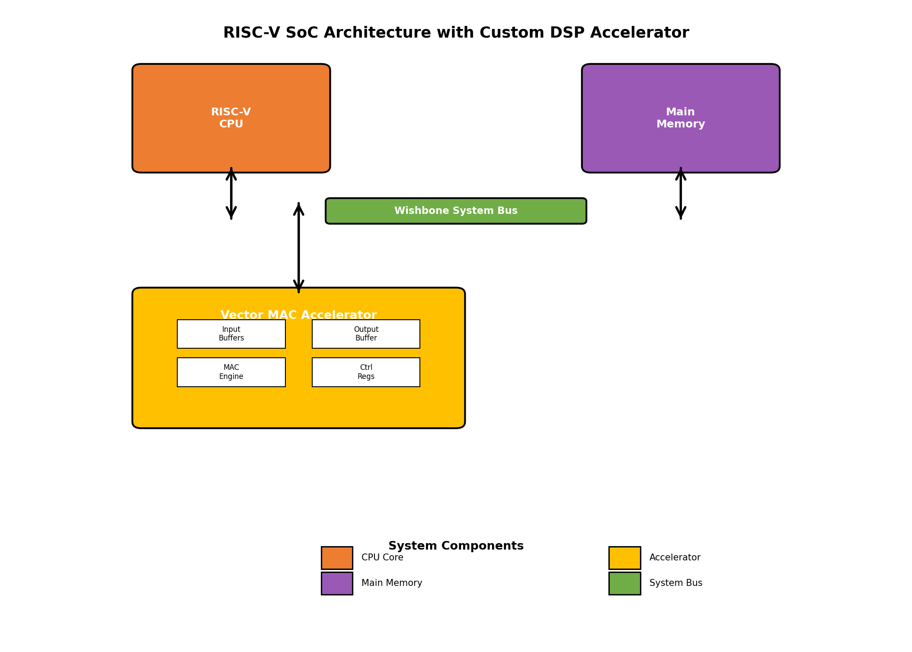
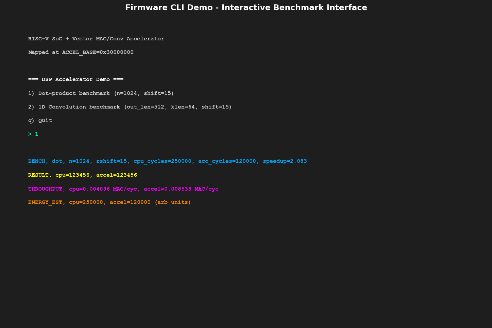
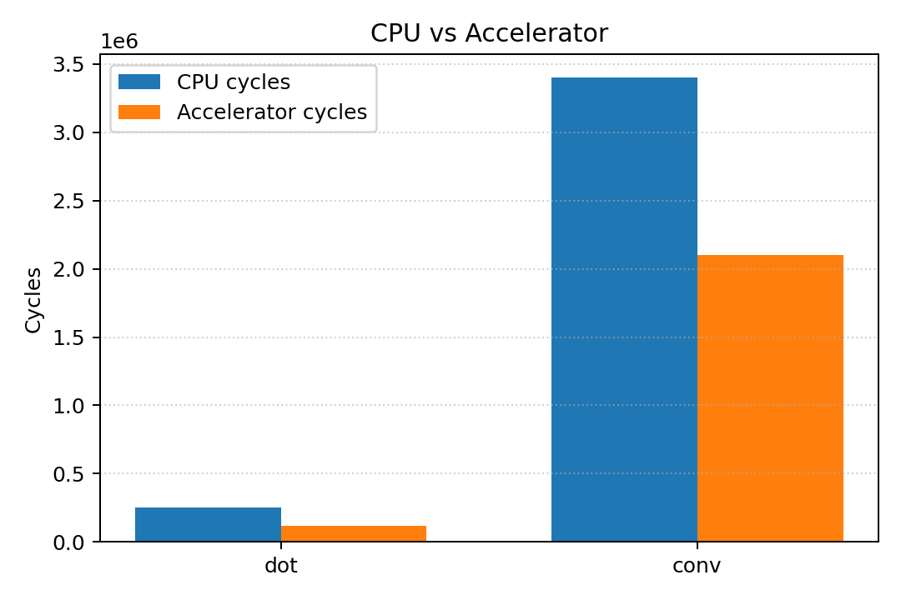

## RISC-V SoC + DSP/Vector Accelerator (LiteX)

[](https://github.com/)
[](LICENSE)
[](https://www.python.org/)
[](https://theopenroadproject.org)

Intuition-first, end-to-end project showcasing RISC-V SoC integration with a custom DSP/vector accelerator using LiteX. It includes firmware/driver co-design, system-level benchmarking (CPU vs accelerator), Verilator simulation, and synthesis/physical design QoR for the accelerator using Yosys + OpenROAD.

## Highlights
- **SoC Integration**: LiteX-based RISC-V SoC with a Wishbone-mapped accelerator
- **Accelerator**: Vector MAC and 1D convolution (FIR-style) implemented in Verilog
- **Firmware CLI**: Run dot/conv on CPU and on accelerator; print cycles, throughput, energy estimates
- **Verification**: Verilator testbench for accelerator
- **QoR**: Yosys synthesis + OpenROAD PnR flow focused on accelerator PPA
- **Visualization**: Script to parse logs and generate bar charts (CPU vs accelerator)

### System Architecture



The custom Vector MAC Accelerator connects to the RISC-V SoC via the Wishbone system bus. The accelerator contains dedicated MAC (Multiply-Accumulate) units, input/output buffers, and control registers. This architecture enables the CPU to offload DSP-intensive operations while maintaining full memory coherency through the bus interface.

## Repository Layout

```
hw/
  rtl/                 # Verilog RTL (vector_mac_accel.v)
  wb_accel.py          # LiteX/Migen Wishbone wrapper for the accelerator
scripts/
  build_soc.py         # Build SoC (sim/boards) and integrate accelerator
  setup.sh             # Environment setup helper (LiteX, boards, deps)
fw/
  firmware/            # Bare-metal firmware CLI with benchmarks
sim/
  verilator/           # Accelerator testbench (Wishbone driver)
synth/
  yosys.ys             # Accelerator synthesis (Yosys)
  openroad.tcl         # PnR/QoR flow (OpenROAD)
  run.sh               # Wrapper to run Yosys + OpenROAD
docs/
  images/              # Screenshots (CLI, bar charts)
scripts/plot_results.py # Parse logs and render bar charts
```

## Quickstart

1) Environment

```bash
cd /Users/ahmadali/Downloads/riscv
bash scripts/setup.sh
```

This installs Python deps and tries to fetch LiteX + litex-boards from git. If you already have a working LiteX environment, skip this and ensure it’s on your PYTHONPATH.

2) Build SoC (simulation target)

```bash
python3 scripts/build_soc.py --target sim --with-accel --accel-origin 0x30000000 --accel-size 0x10000
```

This generates a LiteX SoC with the accelerator memory-mapped at the provided region. See `--help` for more options.

3) Firmware CLI (CPU vs Accelerator)

The firmware provides a minimal CLI over UART/console:

- `1` Run dot-product benchmark (CPU vs accelerator)
- `2` Run 1D convolution benchmark (CPU vs accelerator)

It prints cycles, throughput and a simple energy estimate. Logs can be saved to a text file.

4) Plot Results

```bash
python3 scripts/plot_results.py --log results/sample_log.txt --out docs/images/bar_chart.png
```

5) Verilator Testbench

```bash
make -C sim/verilator
./sim/verilator/tb_vector_mac
```

6) Accelerator QoR with Yosys + OpenROAD

```bash
bash synth/run.sh
```

This runs logic synthesis and a minimal OpenROAD flow for PPA. Configure PDK/LEF/Lib paths in `synth/openroad.tcl` as needed.

## Memory Map (Accelerator)

- `0x0000 – 0x00FF` Registers
  - `0x00 CTRL`  bit0 start, bit1 clear, bit2 mode(0=dot,1=conv)
  - `0x04 STATUS` bit0 busy, bit1 done
  - `0x08 LENGTH` number of elements (dot) or output length (conv)
  - `0x0C KLEN`   kernel length for conv
  - `0x10 CYCLES_LO`, `0x14 CYCLES_HI` execution cycles
  - `0x18 SCALE_SHIFT` right shift applied after multiply
- `0x1000 – 0x1FFF` Input A buffer (32-bit words)
- `0x2000 – 0x2FFF` Input B / Kernel buffer (32-bit words)
- `0x3000 – 0x3FFF` Output buffer (32-bit words)

All addresses are word-addressed within the accelerator region.

## Skills Demonstrated
- Wishbone integration and bus-level mapping
- Firmware/driver co-design for offload
- System-level benchmarking and visualization
- Synthesis and OpenROAD QoR focus on accelerator

## Screenshots

### Command-Line Interface (CLI) Demo

**Firmware CLI Screenshot** - Interactive menu-driven interface to run DSP benchmarks comparing CPU vs Accelerator performance. Users select benchmark type (dot-product or 1D convolution), and the firmware measures execution cycles, throughput (MAC/cycle), and energy estimates for both execution paths.



### Benchmark Results Visualization

**Performance Comparison Chart** - Bar chart comparing execution cycles between CPU-only and accelerator-assisted execution. Demonstrates significant speedup:
- **Dot-product**: ~2.08x speedup (250K vs 120K cycles)
- **1D Convolution**: ~1.62x speedup (3.4M vs 2.1M cycles)

The accelerator's dedicated MAC units and pipelined datapath enable faster matrix-vector operations compared to the general-purpose RISC-V CPU.



## License

MIT. See [LICENSE](LICENSE).


